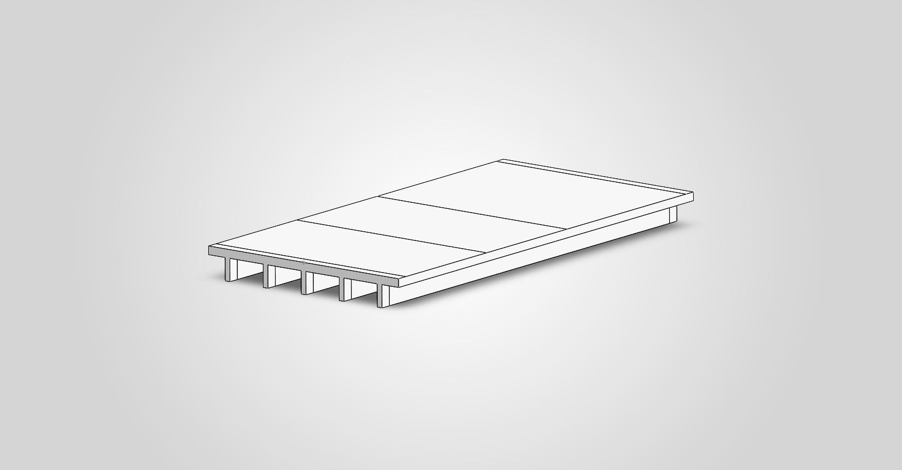
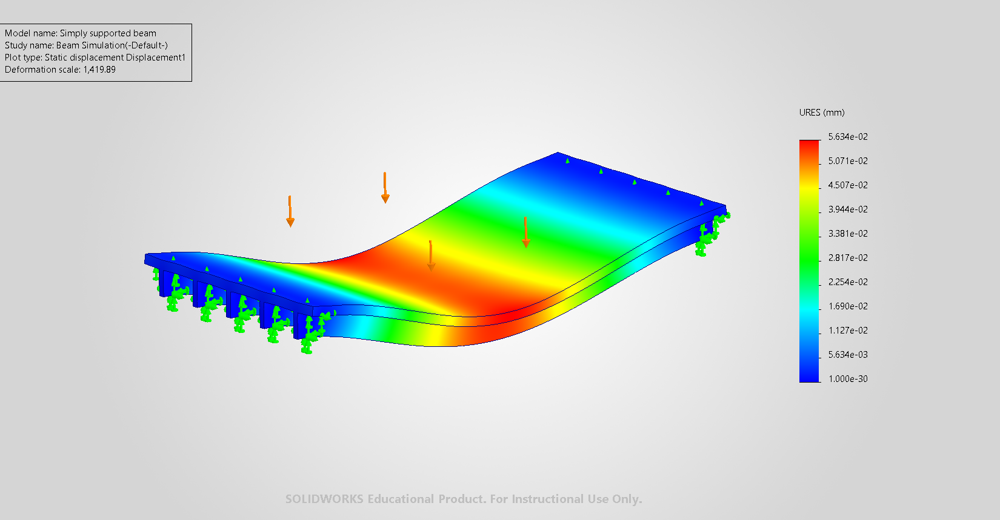
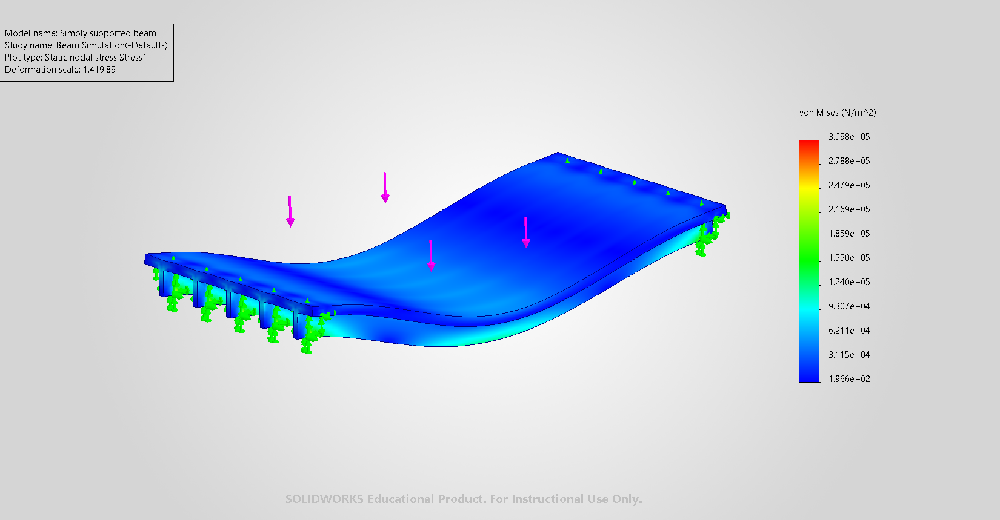

# Bride-Static-Analsys
# Static Analysis of PMMA Bridge Using SolidWorks

Bridges must carry applied loads while maintaining adequate strength and stiffness. Understanding how these loads pass through the deck, beams, and supports is important for identifying highly stressed regions and limiting excessive deformation. Finite-element simulation provides a way to investigate thisstructural behaviour before constructing or testing a physical model. It predicts stress, strain, and displacement distributions and allows engineers to examine the effects of material properties, geometry, support conditions, and load placement.

Comparing numerical predictions with experimental measurements helps evaluate modelling assumptions and identify differences between the idealized model and the actual structure.

## Objective

To Develop a SolidWorks structural model based on a published bridge experiment and investigate its response under static loading.
To evaluate the selected numerical method against experimental result

## The project workflow

```text
Create 3D bridge geometry in SolidWorks
                ↓
Assign material properties
                ↓
Define supports and loading conditions
                ↓
Generate finite-element mesh
                ↓
Run static structural simulation
                ↓
Evaluate displacement and stress results
                ↓
Compare predicted response with physical test measurements
```
## Initial and boundary conditions
- Solver: SolidWorks Simulation
- Analysis type: Linear static structural simulation
- Overall length: 800 mm
- Support span: 760 mm
- Width: 400 mm
- Height: 55 mm


## Results
### Static-load setup



*Static simulation setup showing the applied load and support conditions.*


### Displacement



*Predicted displacement distribution under the applied static load.*

### Stress distribution



*Stress distribution from the SolidWorks Simulation analysis.*

The SolidWorks Simulation results were compared with physical-test measurements. The predicted elastic response showed approximately 97% agreement with the measured behaviour for the evaluated loading condition.
